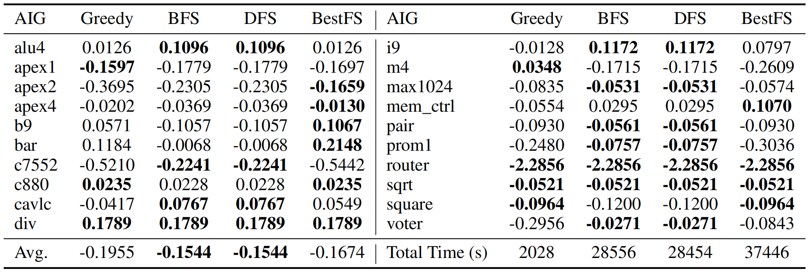
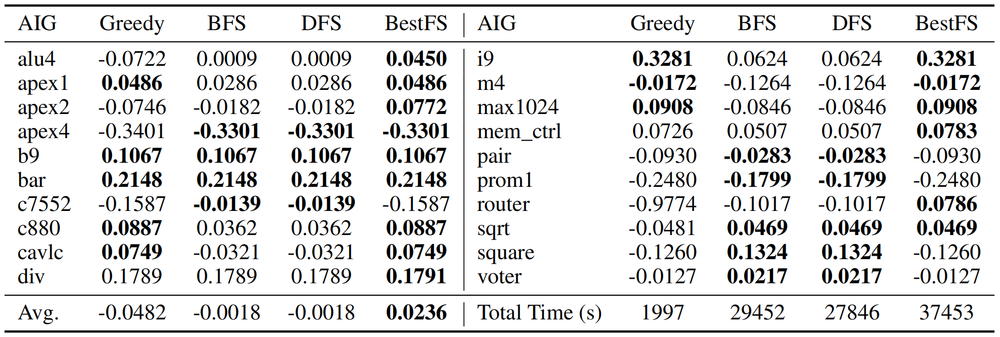
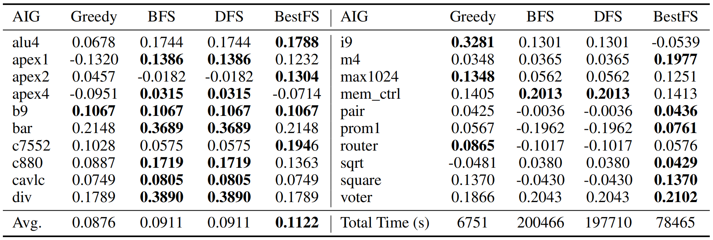
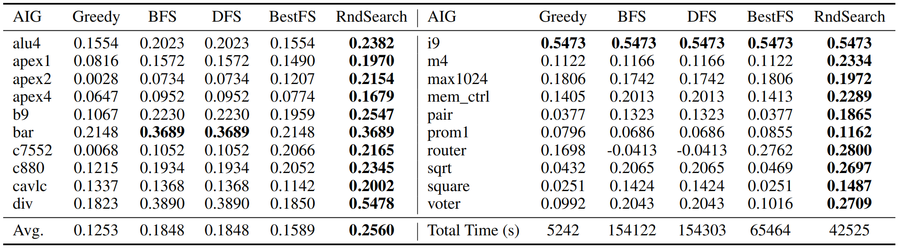
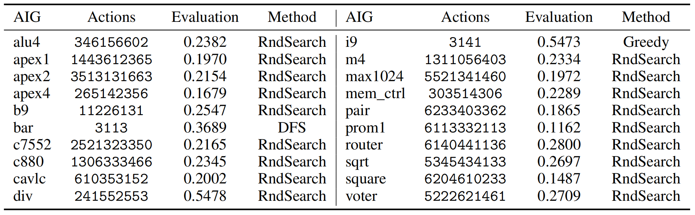

# CS3308 Machine Learning IC Design project

The repository of "Machine Learning for Integrated Circuit Design" project in CS3308 machine learning course.

Authors: [aHapBean](https://github.com/aHapBean), [zzzhr97](https://github.com/zzzhr97), [XiaoyangLiu39](https://github.com/XiaoyangLiu39)

## Environment Setup

### Step 1: Install `abc_py`
First, install the `abc_py` package by following the instructions provided in the [abc_py GitHub repository](https://github.com/krzhu/abc_py).

### Step 2: Install PyTorch
Install PyTorch. We use `torch==1.13.1`, but other versions of PyTorch may also be compatible.

### Step 3: Install PyTorch Geometric Dependencies
Before installing `torch_geometric`, you need to install its dependencies. Follow the instructions on the [PyTorch Geometric website](https://pytorch-geometric.com/whl/).

For `torch==1.13.1`, you can install the following versions of the dependencies:

- `torch-cluster`: `1.6.1+pt113cu116`
- `torch-scatter`: `2.1.1+pt113cu116`
- `torch-sparse`: `0.6.15+pt113cu116`

### Step 4: Install `torch_geometric`
After installing the dependencies, you can install `torch_geometric`. We use `torch_geometric==2.3.1`.

### Step 5: Install Remaining Dependencies
Finally, install the remaining dependencies by running the following command:

```bash
pip install -r requirements.txt
```


## Data Preprocessing

Place the `project` directory in the `Path/To/The/Repository/` (i.e. `./`). The `./project/` directory should include the following subdirectories:

- `InitialAIG`
- `lib`
- `project_data`
- `project_data2`

The processed data will be stored in `./project/pyg`. There is no need to run specific code for data processing as it is included in the training code.

**Note:** For coding convenience, the `mem_ctrl.aig` file in the `./project/InitialAIG/test` directory should be renamed to `memctrl.aig`.

## Task 1: Predictive Models Training

We designed 5 models to be used in `model.py`:
- GCN (class GCN)
- GAT (class PureGAT)
- GIN (class GIN)
- GCN+GAT-S (class EnhancedGCN)
- GCN+GAT-D (class DeeperEnhancedGCN)

To train models that predict the current evaluation of the AIG file, run the following command:

```bash 
cd task1/
CUDA_VISIBLE_DEVICES=[GPU_ID] python main.py --datasize [USED_DATA] --batch-size [BS] --model [MODEL] --lr [LR]
# The USED_DATA can be any value from 1 to 89056. We use USED_DATA=5000.
```

The hyperparameters for each model are shown below:

| Models      | Epochs | Optimizer | Learning Rate | Batch Size |
|-------------|--------|-----------|---------------|------------|
| GCN         | 200    | Adam      | 0.002         | 64         |
| GAT         | 200    | Adam      | 0.002         | 64         |
| GIN         | 200    | Adam      | 0.001         | 64         |
| GCN+GAT-S   | 200    | Adam      | 0.004         | 64         |
| GCN+GAT-D   | 200    | Adam      | 0.001         | 32         |

The best checkpoint and log files will be stored in `./task1/log/`. The training results (on the validation dataset) obtained by us are shown as follows:

| Model       | MSE     | MAE     | Time (s) |
|-------------|---------|---------|----------|
| GCN         | 0.00468 | 0.0438  | 35546    |
| GAT         | 0.00405 | 0.0403  | 50914    |
| GIN         | 0.00472 | 0.0445  | **32308**|
| GCN+GAT-S   | 0.00526 | 0.0472  | 42357    |
| GCN+GAT-D   | **0.00212** | **0.0279**  | 69584    |


## Task 1 Predictive model further finetuning

Though our model performs great in the given validation dataset, it cannot generalize well to the test dataset through our testing.  For example, we generate 1100 AIG files using the test dataset and use the Yosys-abc to evaluate the score of the files, comparing with the values predicted by our model. The results show that while our model in task 1 (GCN+GAT-D) achieves MSE 0.00212 and MAE 0.0279 in the validation dataset, it only gets MSE 0.2310 and MAE 0.3045 in the test dataset.

To address this, we approached the task as transductive learning, meaning the test set is partially visible during training. For each AIG file in the test set, we generated 50 data sequences, each containing 10 actions. For each action’s resulting AIG file, Yosys ABC was used to generate corresponding labels for model finetuning.

To generate the training dataset, run:

```bash
cd task1_finetune/
python generate.py
```
The generated dataset will be stored in `./project/project_finetune_data/`.

To train the model, run:
```bash
cd task1_finetune/
CUDA_VISIBLE_DEVICES=[GPU_ID] python main.py --batch-size [BS] --model [MODEL] --lr [LR]
```

For the GCN+GAT-D mode, we get enhanced test performance. The predictive test performance improves a lot after finetuning, from MSE 0.2310 and MAE 0.3045 to the MSE 0.0105, MAE 0.0608.

The best checkpoint and the log file will be stored in `./task1_finetune/log_finetune/`

## Task 2 Predictive model training 
<!-- predict the future score -->
In Task 2, we are going to train a model for predicting future rewards associated with a given AIG. This process follows the same training and testing configurations as Task 1 but employs a distinct dataset tailored specifically for future reward prediction.

To train models that predict the future reward of the AIG file, run the following command:
``` shell
cd task2
CUDA_VISIBLE_DEVICES=[GPU_ID] python main.py --datasize [USED_DATA] --batch-size [BS] --model [MODEL] --lr [LR]
# We use USED_DATA=5000.
```

The best checkpoint and log files will be stored in `./task2/log/`. The training results (on the validation dataset) obtained by us are shown as follows:

| Model       | MSE     | MAE     | Time (s) |
|-------------|---------|---------|----------|
| GCN         | 0.01007 | 0.0630  | 37921    |
| GAT         | 0.00931 | 0.0609  | 50632    |
| GIN         | 0.00915 | 0.0584  | **33324**|
| GCN+GAT-S   | 00.01061| 0.0658  | 43229    |
| GCN+GAT-D   | **0.00779** | **0.0544**  | 67658    |

## Task 2 Final Logic synthesis decision

We use the models trained before and `yosys-abc` to give the final evaluation prediction. Then, different search methods are employed to find the optimal sequence of actions:
- Greedy
- BFS (Depth-First Search)
- DFS (Depth-First Search)
- Best First Search
- Random Search

The parameter settings of these search methods:

| Methods         | Data Structure | Maxsize | Steps |
|-----------------|----------------|---------|-------|
| Greedy          | Array          | Inf     | 10    |
| BFS             | Queue          | Inf     | 4     |
| DFS             | Queue          | Inf     | 4     |
| BestFirstSearch | Priority Queue | 25      | 10    |
| RandomSearch    | Array          | 500     | 10    |

Additionally, we use three different evaluation functions:
- **Cur<sub>gnn</sub> + Future<sub>gnn</sub>:** Combine the values predicted by both GNN models to derive the final evaluation.
- **Cur<sub>abc</sub> + Future<sub>gnn</sub>:** Employ `yosys-abc` to calculate the current evaluation and then add it to the predicted reward from the second model to achieve the final evaluation.
- **Cur<sub>abc</sub>:** Only use `yosys-abc` to predict the current evaluation without future reward. This directly reflects the real scores of the current AIG. This scenario is especially useful for Random Search.

To optimize the AIG on the test dataset, you can run the following command:
```shell
# [D/B] denotes DFS or BFS
python task2.py --n_steps 4 --method [D/B] --predict abc_now
CUDA_VISIBLE_DEVICES=[GPU_ID] python task2.py --n_steps 4 --method [D/B] --predict abc_now_gnn_future
CUDA_VISIBLE_DEVICES=[GPU_ID] python task2.py --n_steps 4 --method [D/B] --predict gnn_now_gnn_future

# Greedy
python task2.py --n_steps 10 --method Greedy --predict abc_now
CUDA_VISIBLE_DEVICES=[GPU_ID] python task2.py --n_steps 10 --method Greedy --predict abc_now_gnn_future
CUDA_VISIBLE_DEVICES=[GPU_ID] python task2.py --n_steps 10 --method Greedy --predict gnn_now_gnn_future

# Best First Search
python task2.py --n_steps 10 --maxsize 25 --method BestFirstSearch --predict abc_now
CUDA_VISIBLE_DEVICES=[GPU_ID] python task2.py --n_steps 10 --maxsize 25 --method BestFirstSearch --predict abc_now_gnn_future
CUDA_VISIBLE_DEVICES=[GPU_ID] python task2.py --n_steps 10 --maxsize 25 --method BestFirstSearch --predict gnn_now_gnn_future

# Random Search
python task2.py --n_steps 10 --maxsize 500 --method RandomSearch --predict abc_now
CUDA_VISIBLE_DEVICES=[GPU_ID] python task2.py --n_steps 10 --maxsize 500 --method RandomSearch --predict abc_now_gnn_future
CUDA_VISIBLE_DEVICES=[GPU_ID] python task2.py --n_steps 10 --maxsize 500 --method RandomSearch --predict gnn_now_gnn_future
```

The results of different methods:
<details>
<summary>
Results of <strong>Cur<sub class="subscript">gnn</sub> + Future<sub class="subscript">gnn</sub></strong> before finetune
</summary><p></p></details>

<details>
<summary>
Results of <strong>Cur<sub class="subscript">gnn</sub> + Future<sub class="subscript">gnn</sub></strong> after finetune
</summary><p></p></details>

<details>
<summary>
Results of <strong>Cur<sub class="subscript">abc</sub> + Future<sub class="subscript">gnn</sub></strong>
</summary><p></p></details>

<details>
<summary>
Results of <strong>Cur<sub class="subscript">abc</sub></strong>
</summary><p></p></details>

---

The final results (the best actions and corresponding evaluation values) of each AIG file in test dataset:
<details>
<summary>
<strong>Final results of best actions</strong>
</summary><p></p></details>

## maml few shot

This is xxx...,see [MAML_README](./maml_few_shot/README.md) for details.

<!-- ## TODO

The following content will be added soon.
- Add training guidance
- Add files introduction
- Format the files in the project -->

<!-- ## task 2

Model: 
> - GCN (GCN)
> - GAT (PureGAT)
> - GCN + GAT (EnhancedGCN)
> - Deeper GCN + GAT (DeeperEnhancedGCN)

*The `concat` operation is adopted by default in the model.

Search algorithm:
> TODO -->