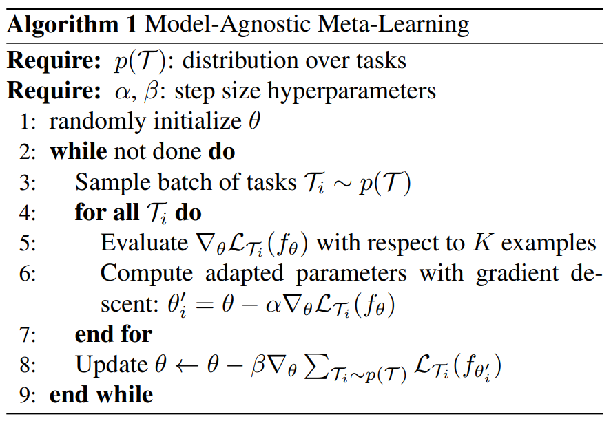

# Model-Agnostic Meta-Learning Algorithm

This folder's files are based on a personalized environment by ***Xiaoyang Liu***. The algorithm is shown below. 

    

## Data Split and Extraction

In this environment, we split the training data into a training set and a validation set. There are 23 IC categories in total, with 18 for training and 3 for validation. The other 2 ICs are omitted due to their huge memory usage (over 5GB each). To optimize training time, we first extract the graph data and save them to `.pkl` files, which are then directly loaded during the training stage.

The script `6get_aig.py` is used to extract the data. Note that each IC graph can produce a large number of variants (e.g., ***40K+***), so we constrain this number by randomly selecting only 1/8 of the original data for each IC graph. This results in a total of ***100K+*** samples for training and validation. The script `8launch.sh` uses multi-processing techniques to extract data, enabling concurrent feature extraction to be completed in just 2 hours.

## Training Stage

The meta-learning framework uses an N-way K-shot task formulation. For each iteration during the training stage, we have:
- `bs_task`: the number of tasks
- `bs_support_cate`: N (categories in a task)
- `bs_support_train`: K (instances per category in the support set)
- `bs_support_per`: the total number of instances per category in a task

Thus, `bs_support_per - bs_support_train` is the number of instances in the query set for each category.

For each task, the model updates its parameters from $\theta$ to $\theta^\prime$ on the support set and tests $\theta^\prime$ on the query set. The aggregated loss on the query set from all tasks in an iteration is used to update $\theta$.

## Evaluation Stage

During the test stage, only a few instances are needed to update the model. A good initialization and quick adaptation lead to strong performance on the few-shot test set.
